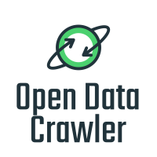

<div id="top"></div>

[![Contributors][contributors-shield]][contributors-url]
[![Forks][forks-shield]][forks-url]
[![Stargazers][stars-shield]][stars-url]
[![Issues][issues-shield]][issues-url]
[![MIT License][license-shield]][license-url]
[![LinkedIn][linkedin-shield]][linkedin-url]


<!-- PROJECT LOGO -->
<br />
<div align="center">
  <a href="https://github.com/aberenguerpas/opendatacrawler">
    
  </a>

  <h3 align="center">Open data crawler</h3>

  <p align="center">
    An awesome tool to craw data to your projects from open data portals
    <br />
    <a href="https://github.com/aberenguerpas/opendatacrawler/issues">Report Bug</a>
    ·
    <a href="https://github.com/aberenguerpas/opendatacrawler/issues">Request Feature</a>
  </p>
</div>


<!-- TABLE OF CONTENTS -->
<details>
  <summary>Table of Contents</summary>
  <ol>
    <li>
      <a href="#about-the-project">About The Project</a>
    </li>
    <li>
      <a href="#getting-started">Getting Started</a>
      <ul>
        <li><a href="#requirements">requirements</a></li>
        <li><a href="#installation">Installation</a></li>
      </ul>
    </li>
    <li><a href="#usage">Usage</a></li>
    <li><a href="#roadmap">Roadmap</a></li>
    <li><a href="#contributing">Contributing</a></li>
    <li><a href="#license">License</a></li>
    <li><a href="#contact">Contact</a></li>
  </ol>
</details>


<!-- ABOUT THE PROJECT -->
## About The Project
Open Data Crawler is a tool to extract data from open data portals and statistics portals. The community can contribute adding support to other data portals or adding new features.

Features:
* Download datasets from open data portals or statsitics portal
* Download metadata from datasets
* Filter by data type
* Filter by topic

<p align="right">(<a href="#top">back to top</a>)</p>

<!-- GETTING STARTED -->
## Getting Started

This is an example of how you may give instructions on setting up your project locally.
To get a local copy up and running follow these simple example steps.

### Requirements
You need python 3.9 installed

* Install the requirements from requirements.txt

* ```sh
    pip install -r requirements.txt
    ```

### Installation

1. Clone the repo
   ```sh
   git clone https://github.com/aberenguerpas/opendatacrawler.git
   ```
2. Run from the project root
   ```sh
   python setup.py install 
   ```
<p align="right">(<a href="#top">back to top</a>)</p>


<!-- USAGE EXAMPLES -->
## Usage

Use this tool is very simple, you only need to specify the data source and the tool automatically detect the portal type and starts to dowload the data.

### Examples
#### Dowload all data from a portal:
```
python -m opendatacrawler -d https://data.smartdublin.ie/
```
#### Dowload all data with their metadata:
```
python -m opendatacrawler -d https://data.smartdublin.ie/ -m
```
#### Dowload specific fromat data. For example xls and csv:
```
python -m opendatacrawler -d https://data.smartdublin.ie/ -t xls csv
```
#### Dowload specifics categories. For example xls and csv:
```
python -m opendatacrawler -d https://data.smartdublin.ie/ -c tourism transport
```
#### Help with all posible commands:
```
python -m opendatacrawler -h
```


_For more examples, please refer to the [Documentation](https://example.com)_

<p align="right">(<a href="#top">back to top</a>)</p>


## Currently supported portals and sites

- [x] CKAN 
- [x] Socrata
- [x] https://databank.worldbank.org/
- [x] https://data.oecd.org/


See the [open issues](https://github.com/aberenguerpas/opendatacrawler/issues) for a full list of proposed features (and known issues).

<p align="right">(<a href="#top">back to top</a>)</p>


<!-- CONTRIBUTING -->
## Contributing

Contributions are what make the open source community such an amazing place to learn, inspire, and create. Any contributions you make are **greatly appreciated**.

If you have a suggestion or add site/portal support that would make this better, please fork the repo and create a pull request. You can also simply open an issue with the tag "enhancement".
Don't forget to give the project a star! Thanks again!

1. Fork the Project
2. Create your Feature Branch (`git checkout -b feature/AmazingFeature`)
3. Commit your Changes (`git commit -m 'Add some AmazingFeature'`)
4. Push to the Branch (`git push origin feature/AmazingFeature`)
5. Open a Pull Request

<p align="right">(<a href="#top">back to top</a>)</p>


<!-- LICENSE -->
## License

Distributed under the MIT License. See `LICENSE` for more information.

<p align="right">(<a href="#top">back to top</a>)</p>

## Colaborators


<!-- CONTACT -->
## Contact

🙋‍♂️Alberto Berenguer Pastor \
📱[@aberenguerpas](https://twitter.com/aberenguerpas) \
✉️ alberto.berenguer@ua.es

<p align="right">(<a href="#top">back to top</a>)</p>


<!-- MARKDOWN LINKS & IMAGES -->
<!-- https://www.markdownguide.org/basic-syntax/#reference-style-links -->
[contributors-shield]: https://img.shields.io/github/contributors/aberenguerpas/opendatacrawler?style=for-the-badge
[contributors-url]: https://github.com/aberenguerpas/opendatacrawler/graphs/contributors
[forks-shield]: https://img.shields.io/github/forks/aberenguerpas/opendatacrawler.svg?style=for-the-badge
[forks-url]: https://github.com/aberenguerpas/opendatacrawler/network/members
[stars-shield]: https://img.shields.io/github/stars/aberenguerpas/opendatacrawler.svg?style=for-the-badge
[stars-url]: https://github.com/aberenguerpas/opendatacrawler/stargazers
[issues-shield]: https://img.shields.io/github/issues/aberenguerpas/opendatacrawler.svg?style=for-the-badge
[issues-url]: https://github.com/aberenguerpas/opendatacrawler/issues
[license-shield]: https://img.shields.io/github/license/aberenguerpas/opendatacrawler?style=for-the-badge
[license-url]: https://github.com/aberenguerpas/opendatacrawler/blob/main/LICENSE
[linkedin-shield]: https://img.shields.io/badge/-LinkedIn-black.svg?style=for-the-badge&logo=linkedin&colorB=555
[linkedin-url]: https://www.linkedin.com/in/alberto-berenguer-pastor-220274154/
[product-screenshot]: images/screenshot.png

